# 30_DAYS_OF_CODE


## DAY - 00
```
Task
To complete this challenge, you must save a line of input from stdin to a variable, print Hello, World. on a single line,and finally print the value of your variable on a second line.
```
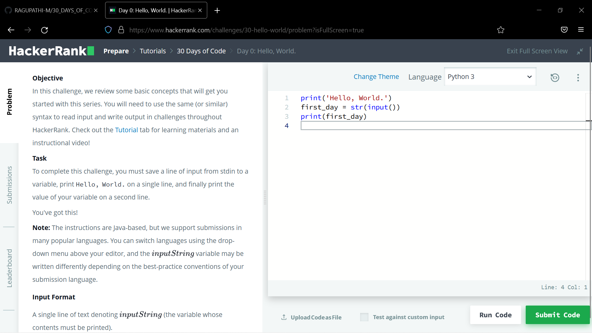
## DAY - 01
```
Task
Complete the code in the editor below. The variables d , l,s and are already declared and initialized for you. 
You must: Declare variables: one of type int, one of type double, and one of type String.
Read lines of input from stdin (according to the sequence given in the Input Format section below) and initialize your variables.
Use the operator to perform the following operations: Print the sum of plus your int variable on a new line.
Print the sum of plus your double variable to a scale of one decimal place on a new line.
Concatenate with the string you read as input and print the result on a new line. 
```
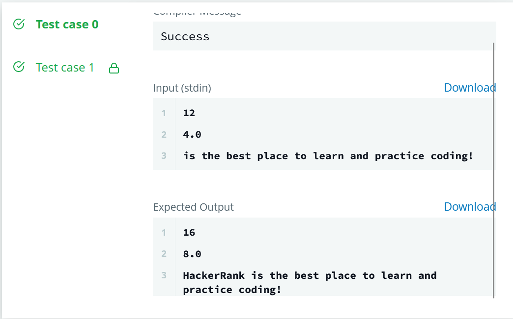
## DAY - 02
```
Task
Given the meal price (base cost of a meal), tip percent (the percentage of the meal price being added as tip), and tax percent (the percentage of the meal price being added as tax) for a meal, and print the meal's total cost. 
Round the result to the nearest integer.
```
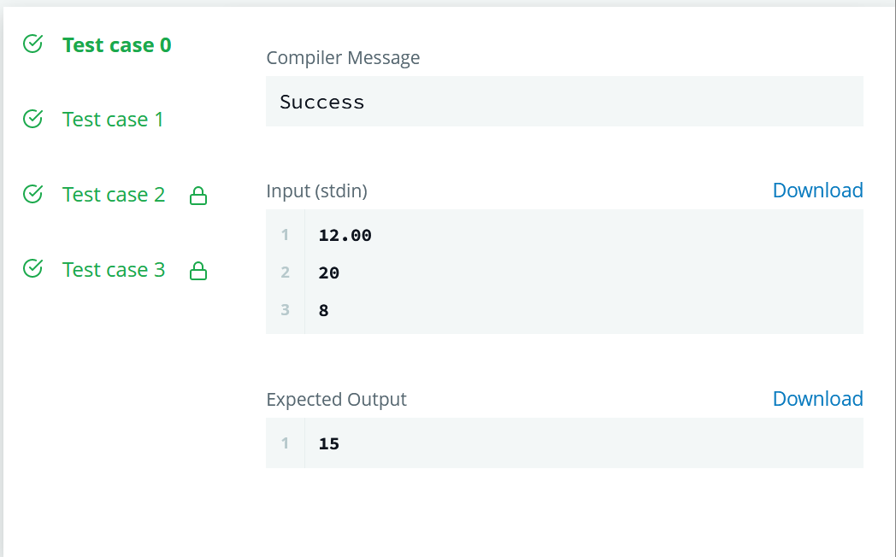
## DAY - 03
```
Task
Given an integer,N, perform the following conditional actions:
If is odd, print Weird
If is even and in the inclusive range of to, print Not Weird
If is even and in the inclusive range of to, print Weird
Ifis even and greater than, print Not Weird

Complete the stub code provided in your editor to print whether or not is weird.
```
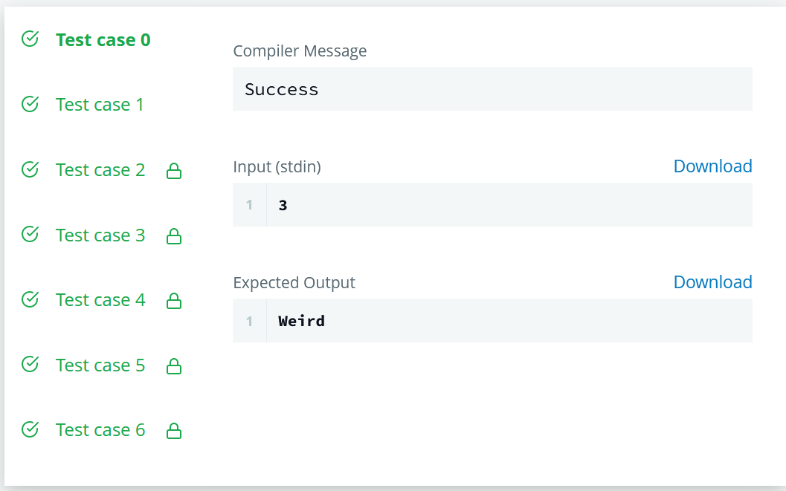
## DAY - 04
```
Task
Write a Person class with an instance variable, , and a constructor that takes an integer, , as a parameter. 
The constructor must assign to after confirming the argument passed as is not negative; if a negative argument is passed as , 
the constructor should set to and print Age is not valid, setting age to 0.. In addition, 
you must write the following instance methods: yearPasses() should increase the instance variable by. amIOld() 
should perform the following conditional actions: If, print You are young.. If and, print You are a teenager.. Otherwise, print You are old..
To help you learn by example and complete this challenge, much of the code is provided for you, but you'll be writing everything in the future. 
The code that creates each instance of your Person class is in the main method. Don't worry if you don't understand it all quite yet!
```
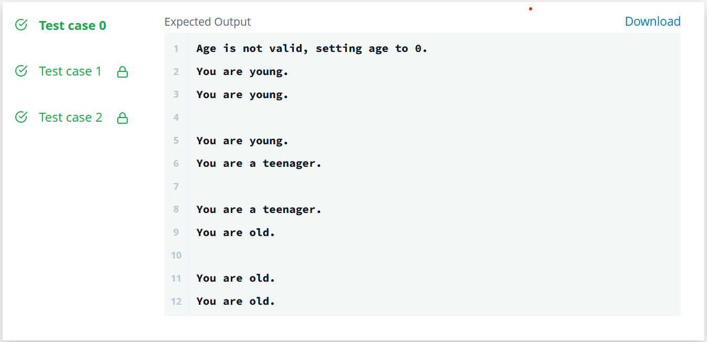
## DAY - 05
```
Task
Given an integer, , print its first multiples. Each multiple (where ) should be printed on a new line in the form: n x i = result.
```
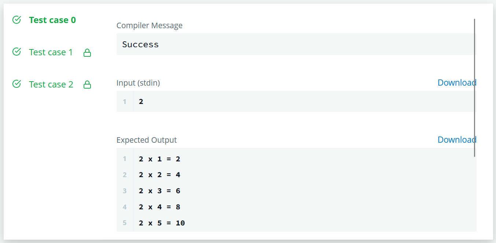
## DAY - 06

```
Task
Given a string, , of length that is indexed from to , print its even-indexed and odd-indexed characters as space-separated strings on a single line (see the Sample below for more detail). 

```
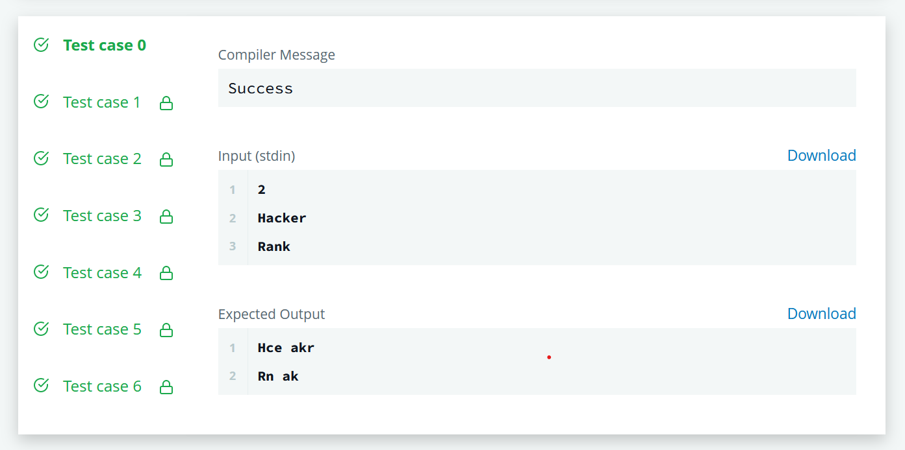
## DAY - 07
```
Task
Given an array, , of integers, print 's elements in reverse order as a single line of space-separated numbers.
```
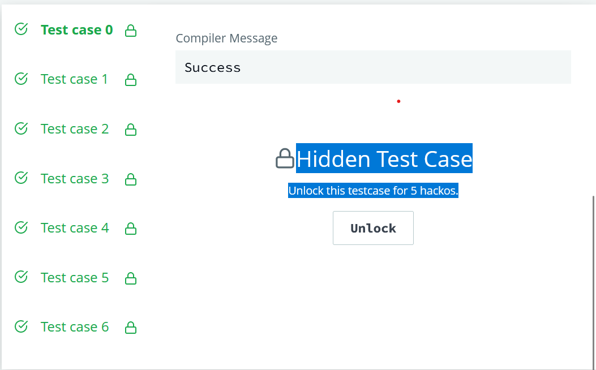
## DAY - 08
```
Task
Given names and phone numbers, assemble a phone book that maps friends' names to their respective phone numbers. You will then be given an unknown number of names to query your phone book for. For each queried, print the associated entry from your phone book on a new line in the form name=phoneNumber; if an entry for is not found, print Not found instead.
```
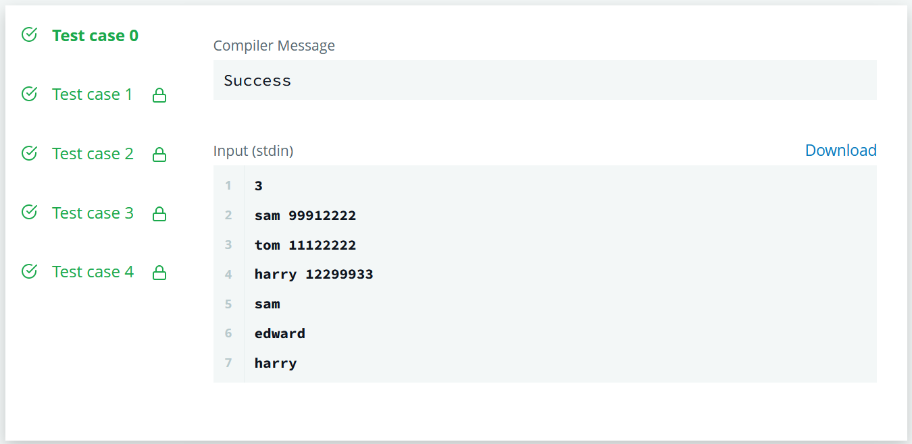
## DAY - 09
```
Task
Recursive Method for Calculating Factorial

```
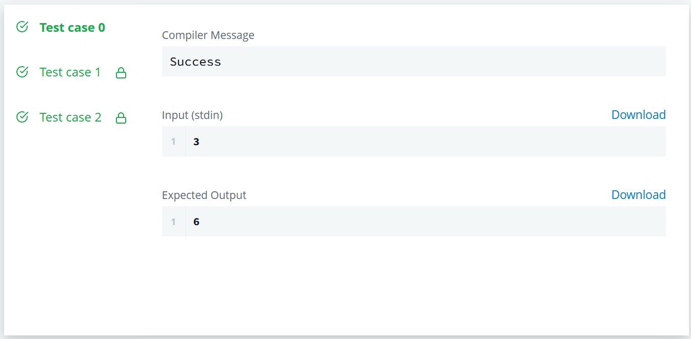
## DAY - 10
```
Task
Given a base- integer, , convert it to binary (base-). Then find and print the base- integer denoting the maximum number of consecutive 's in 's binary representation. When working with different bases, it is common to show the base as a subscript.

```
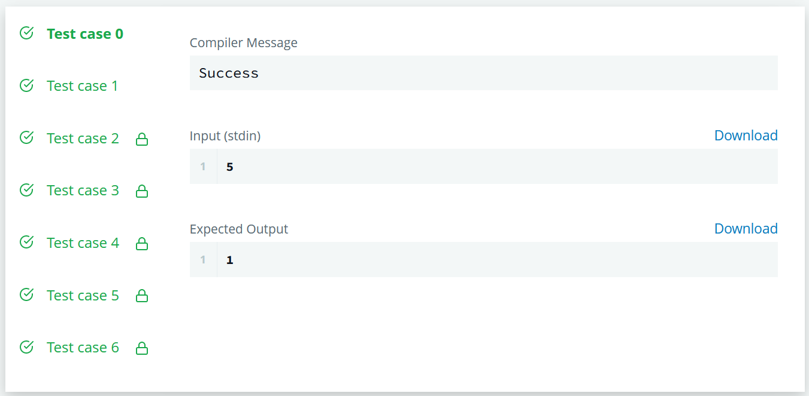
## DAY - 11
```
Task
Calculate the hourglass sum for every hourglass in , then print the maximum hourglass sum.

```
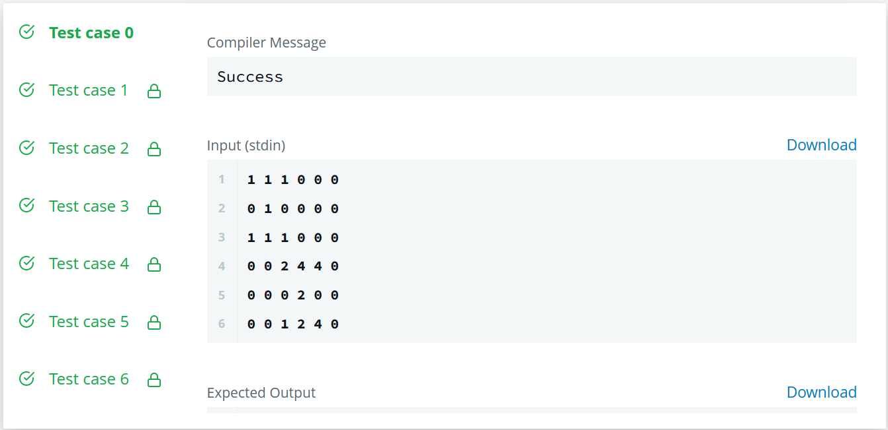
## DAY - 12
```
Task
You are given two classes, Person and Student, where Person is the base class and Student is the derived class. Completed code for Person and a declaration for Student are provided for you in the editor. Observe that Student inherits all the properties of Person.

```
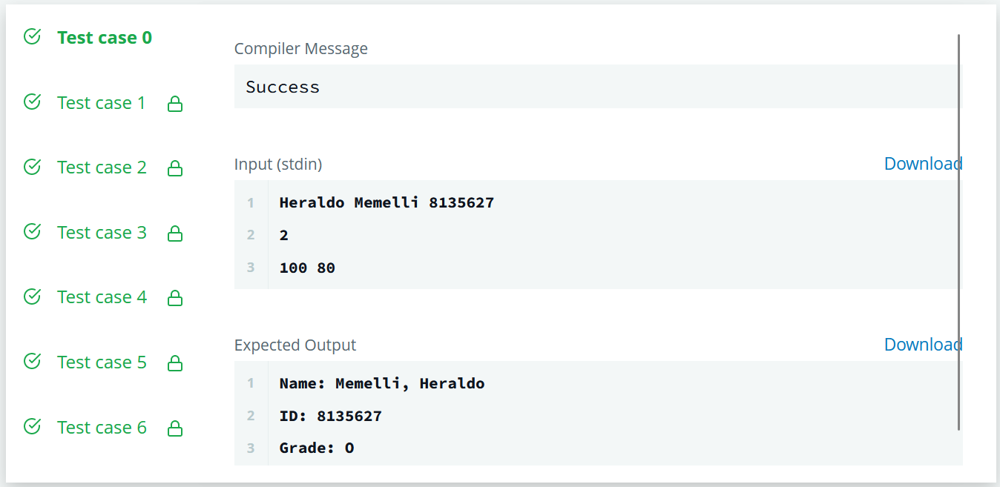
## DAY - 13
```
Task
Given a Book class and a Solution class, write a MyBook class that does the following:

```
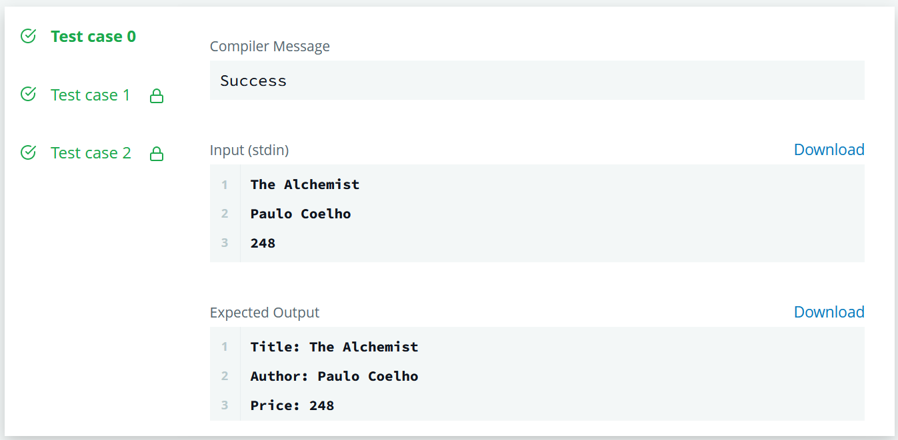
## DAY - 14
```
Task
Complete the Difference class by writing the following:

```
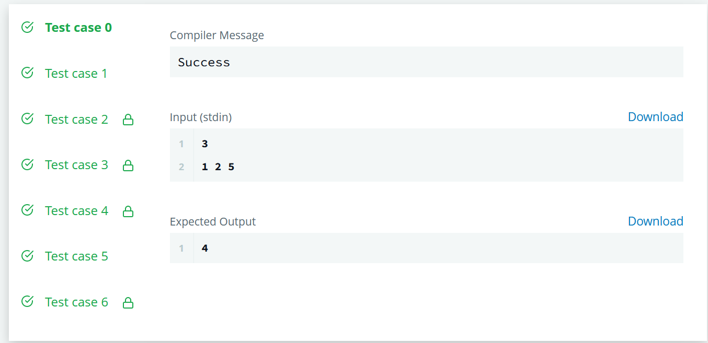