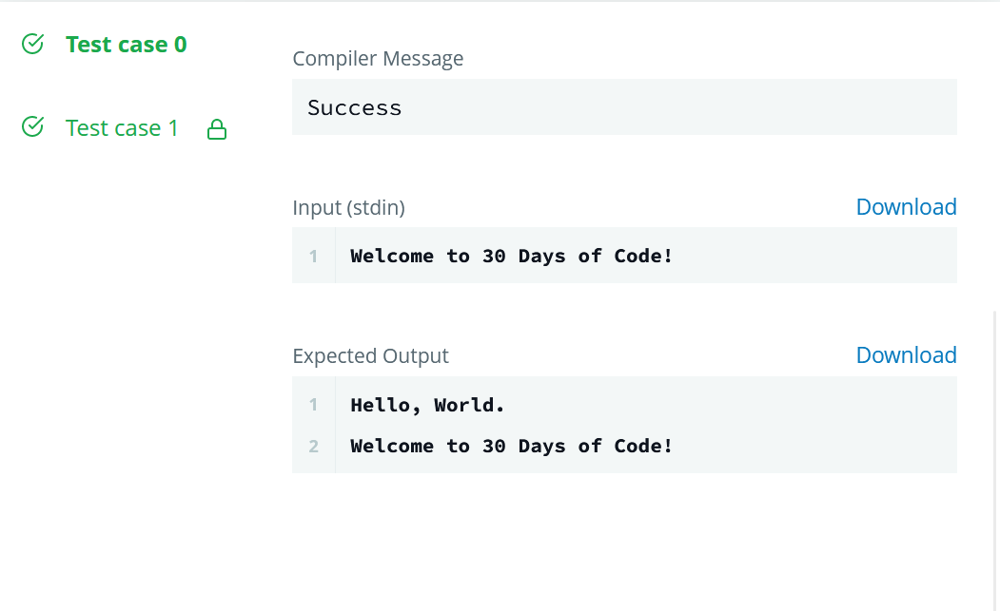

# 30_DAYS_OF_CODE


## DAY - 00
```
Task
To complete this challenge, you must save a line of input from stdin to a variable, print Hello, World. on a single line,and finally print the value of your variable on a second line.
```
